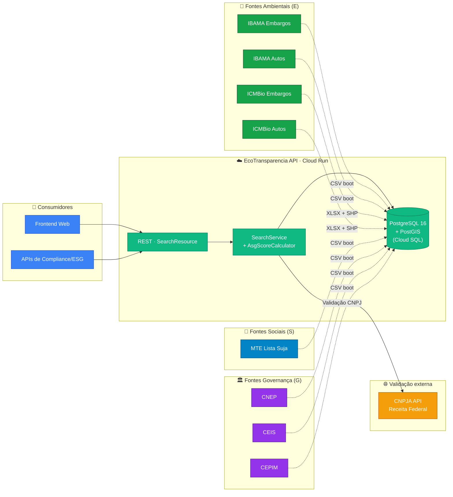
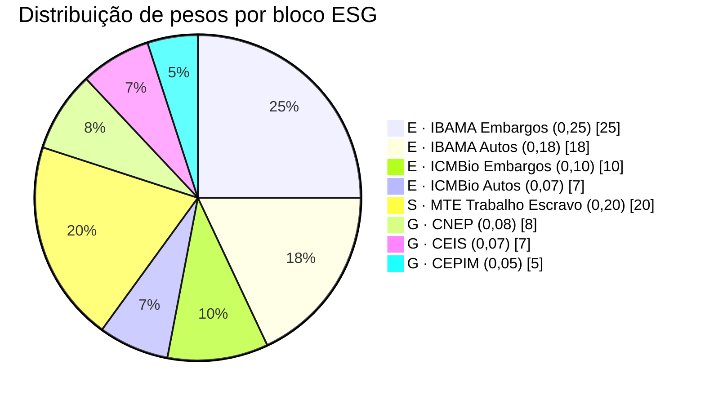
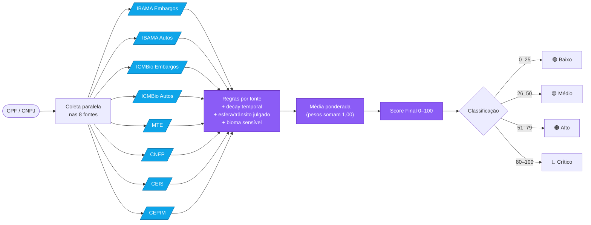
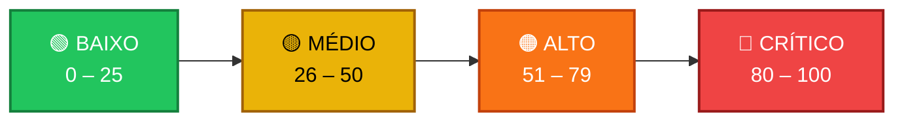
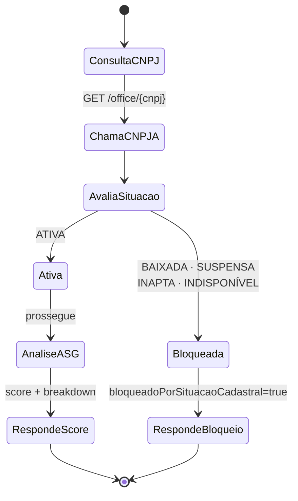
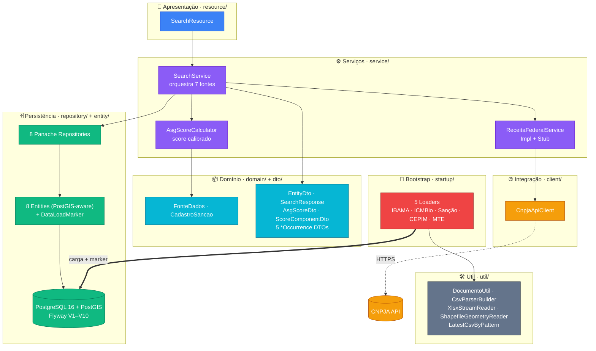
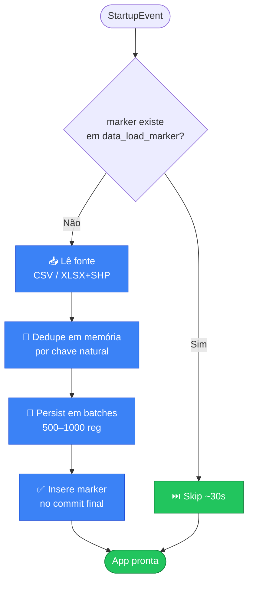
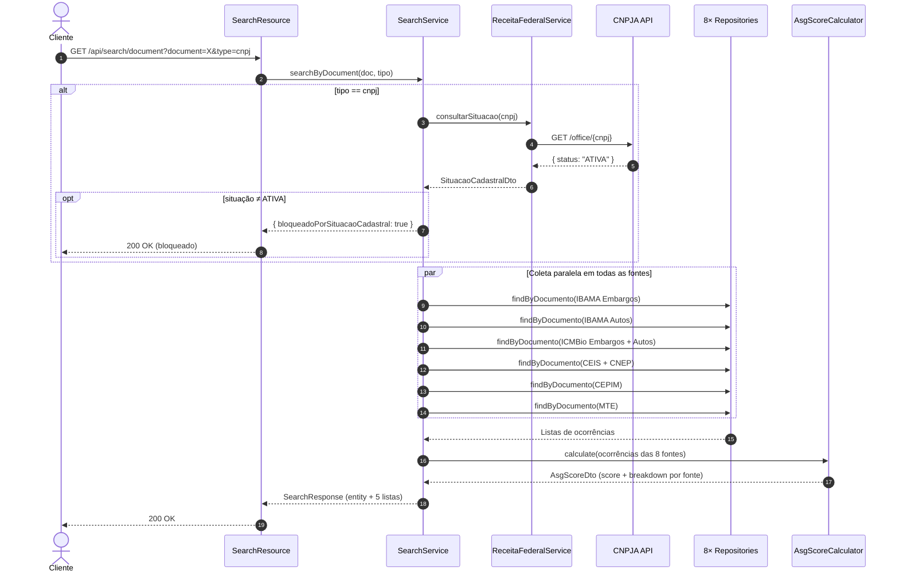
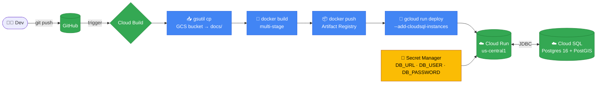

# 🌱 EcoTransparencia API


API REST para análise de risco ASG (Ambiental, Social, Governança) de pessoas físicas e jurídicas a partir de **fontes públicas brasileiras**: IBAMA, ICMBio, CEIS/CNEP/CEPIM (Portal da Transparência) e a Lista Suja do Trabalho Escravo do MTE. Consultando por CPF ou CNPJ, a API agrega ocorrências das 7 fontes, calcula um Score ASG calibrado e devolve um diagnóstico unificado.

> 💡 **Em uma frase:** consulte um CNPJ e receba uma nota de risco ASG de 0 a 100, agregando 8 bases públicas (IBAMA, ICMBio, CEIS, CNEP, CEPIM, MTE) com decay temporal e validação na Receita Federal.

## Sumário

- [Visão de negócio](#visão-de-negócio)
  - [Para que serve](#para-que-serve)
  - [Fontes de dados](#fontes-de-dados)
  - [Score ASG](#score-asg)
- [Visão técnica](#visão-técnica)
  - [Stack](#stack)
  - [Arquitetura](#arquitetura)
  - [Banco de dados e migrações](#banco-de-dados-e-migrações)
  - [Carga inicial e idempotência](#carga-inicial-e-idempotência)
  - [Endpoints](#endpoints)
  - [Testes](#testes)
- [Desenvolvimento local](#desenvolvimento-local)
- [Deploy (Google Cloud)](#deploy-google-cloud)
- [Pendências e próximos passos](#pendências-e-próximos-passos)

---

## Visão de negócio

### Para que serve

Empresas, instituições financeiras e órgãos públicos consultam o histórico ambiental, trabalhista e administrativo de fornecedores, parceiros e clientes antes de fechar negócio. O EcoTransparência consolida 7 bases públicas heterogêneas em uma única consulta por documento (CNPJ), aplicando um score calibrado para classificar o risco.

Casos de uso típicos:

- **Onboarding de fornecedores**: bloquear contratação se houver embargo IBAMA ativo, presença na Lista Suja do MTE, ou inidoneidade no CEIS.
- **Compliance de crédito**: enriquecer a análise de risco com sinais ambientais e de governança que não aparecem em birôs tradicionais.
- **Due diligence M&A**: histórico ambiental + sanções administrativas em um único endpoint.

#### Visão geral do ecossistema



### Fontes de dados

| Fonte | Origem | Bloco ESG | Volume típico | Modo de carga |
|---|---|:---:|---:|---|
| **IBAMA — Embargos** | Portal IBAMA (CSV) | E | ~88k linhas | CSV no boot |
| **IBAMA — Autos de Infração** | Portal IBAMA (CSVs por ano 1977-2025) | E | ~700k linhas | CSV no boot |
| **ICMBio — Autos de Infração** | Dados abertos ICMBio (XLSX + SHP) | E | ~41k linhas | XLSX (POI streaming) + SHP (GeoTools) |
| **ICMBio — Embargos** | Dados abertos ICMBio (XLSX + SHP) | E | ~14k linhas | XLSX + SHP, geometria poligonal |
| **CEIS** — Cadastro de Empresas Inidôneas e Suspensas | Portal da Transparência / CGU | G | ~22k linhas | CSV no boot (ISO-8859-1) |
| **CNEP** — Cadastro Nacional de Empresas Punidas | Portal da Transparência / CGU | G | ~1,6k linhas | CSV no boot (ISO-8859-1) |
| **CEPIM** — Entidades sem fins lucrativos impedidas | Portal da Transparência / CGU | G | ~3,5k linhas | CSV no boot |
| **MTE — Lista Suja do Trabalho Escravo** | Ministério do Trabalho e Emprego | S | ~600 linhas | CSV no boot (Cp1252) |

A geometria do ICMBio (Point para autos, Polygon/MultiPolygon para embargos, EPSG:4674 SIRGAS 2000) é persistida em colunas PostGIS e fica disponível para futuros endpoints de mapa. Não é exposta em DTOs no momento.

### Score ASG

O score é uma **média ponderada** que considera as 8 fontes (IBAMA Embargos, IBAMA Autos, ICMBio Embargos, ICMBio Autos, MTE, CNEP, CEIS, CEPIM). Os pesos somam **1,00** e seguem distribuição **ESG 60/20/20**:

| Fonte | Bloco | Peso |
|---|:---:|---:|
| IBAMA Embargos | E | **0,25** |
| IBAMA Autos | E | 0,18 |
| ICMBio Embargos | E | 0,10 |
| ICMBio Autos | E | 0,07 |
| MTE Trabalho Escravo | S | **0,20** |
| CNEP | G | 0,08 |
| CEIS | G | 0,07 |
| CEPIM | G | 0,05 |
| **Total** | | **1,00** |

#### Composição ESG do Score (60/20/20)



#### Pipeline de cálculo do Score ASG



**Critérios calibrados (2026-04):**

- **Categoria de sanção (CEIS/CNEP)**: inidoneidade=25 · impedimento/proibição=12 · suspensão=10 · multa/publicação=8 · demais=6.
- **Esfera do órgão (CEIS/CNEP)**: federal ×1,0 · estadual ×0,7 · municipal ×0,5.
- **Trânsito em julgado (CEIS/CNEP)**: confirmado ×1,0 · em recurso ×0,6.
- **Recência (todas as fontes)**: ≤5 anos ×1,0 · 5-10 anos ×0,7 · 10-20 anos ×0,4 · >20 anos ×0,2 (decay temporal).
- **UC de proteção integral (ICMBio)**: PARNA, REBIO, ESEC, MONA, REVIS recebem +8 pontos sobre uso sustentável (RESEX, FLONA, APA).
- **Bonus**: CNEP soma faixa por valor da multa · MTE soma +5 com decisão administrativa de procedência + 1 por trabalhador envolvido · CEPIM pondera por motivo (TCE > irregularidade > omissão).
- **Embargos IBAMA**: +15 base · +10 desmatamento · +5 bioma sensível (Amazônia, Mata Atlântica) · +1/10ha (max +10) · ×0,1 se baixado.
- **Autos IBAMA**: +8 base · +5 intencional · +3 efeito grave · +5 bioma sensível · +2 a +12 por faixa de multa.

**Classificação de risco** (`src/.../service/AsgScoreCalculator.java#classifyRiskLevel`):

| Score | Nível |
|---:|---|
| 0-25 | Baixo |
| 26-50 | Médio |
| 51-79 | Alto |
| 80-100 | Crítico |



> Os pesos e critérios estão documentados in-line nos `@TODO` do `AsgScoreCalculator` e em `FonteDados.java`. Calibrações futuras (de produto) devem atualizar tanto a fórmula quanto os testes em `AsgScoreCalculatorTest`.

### Validação de situação cadastral (CNPJ)

Antes da análise ASG, todo CNPJ é validado contra a Receita Federal via [CNPJA API Open](https://cnpja.com/api/open):

- **ATIVA** → segue para a análise.
- **BAIXADA / SUSPENSA / INAPTA / INDISPONÍVEL** → bloqueia a análise; resposta contém `bloqueadoPorSituacaoCadastral: true` e a `situacaoCadastral`.

O bean `ReceitaFederalServiceStub` (default em dev/test) sempre retorna ATIVA. O bean real (`ReceitaFederalServiceImpl`) é ativado em build com `-Decotransparencia.receita-federal.use-real-api=true` (ligado em `%prod`).



---

## Visão técnica

### Stack

| Componente | Tecnologia | Versão |
|---|---|---|
| Framework | [Quarkus](https://quarkus.io/) | 3.30.2 |
| Linguagem | Java | 21 LTS |
| Banco (dev/staging/prod) | **PostgreSQL 16 + PostGIS** | — |
| Banco (testes unitários) | H2 + H2GIS | — |
| Migrações de schema | Flyway | (BOM Quarkus) |
| ORM | Hibernate ORM Panache + Hibernate Spatial | 7.1.10.Final |
| Geometria | JTS (`org.locationtech.jts`) | 1.20.0 |
| CSV parsing | OpenCSV | 5.9 |
| XLSX streaming | Apache POI (XSSFReader SAX) | 5.4.0 |
| Shapefile | GeoTools (gt-shapefile, gt-referencing, gt-epsg-hsql) | 33.0 |
| Spatial em testes | H2GIS (orbisgis) | 2.2.3 |
| OpenAPI / Swagger | SmallRye OpenAPI | (BOM) |
| REST Client (CNPJA) | Quarkus REST Client | (BOM) |
| Testes | JUnit 5, Mockito, REST Assured, Pact (consumer + provider) | — |

### Arquitetura

#### Camadas e dependências



#### Estrutura de diretórios

```
src/main/java/br/com/ecotransparencia/
├── client/                        # CnpjaApiClient + DTOs externos
├── domain/                        # CadastroSancao, FonteDados (enum + pesos)
├── dto/                           # Camada de saída
│   ├── EntityDto.java             # Entidade unificada
│   ├── SearchResponse.java        # Resposta com 5 listas (IBAMA + Fase B + Fase C)
│   ├── AsgScoreDto.java + ScoreComponentDto.java
│   └── *Occurrence.java           # SancaoAdmPublica, Cepim, TrabalhoEscravo, IcmbioAuto, IcmbioEmbargo
├── entity/                        # JPA entities (PostGIS-aware)
│   ├── Embargo.java               # IBAMA
│   ├── AutoInfracao.java          # IBAMA
│   ├── SancaoAdmPublica.java      # CEIS+CNEP unificados (discriminator)
│   ├── Cepim.java                 # CEPIM
│   ├── TrabalhoEscravoMte.java    # MTE
│   ├── IcmbioAutoInfracao.java    # ICMBio + Point geometry
│   ├── IcmbioEmbargo.java         # ICMBio + Geometry (poligonos)
│   └── DataLoadMarker.java        # idempotencia de carga
├── repository/                    # Panache repositories (1 por entidade)
├── resource/SearchResource.java   # endpoints REST
├── service/
│   ├── SearchService.java         # orquestra busca em 7 fontes + Receita Federal
│   ├── AsgScoreCalculator.java    # score calibrado, breakdown por fonte
│   └── ReceitaFederalService(Impl|Stub).java
├── startup/                       # @Observes StartupEvent loaders
│   ├── IbamaDataLoader.java       # embargos IBAMA
│   ├── IbamaAutoInfracaoDataLoader.java
│   ├── SancaoAdmPublicaLoader.java # CEIS+CNEP
│   ├── CepimLoader.java
│   ├── TrabalhoEscravoMteLoader.java
│   └── IcmbioLoader.java          # XLSX (POI) + SHP (GeoTools), join por vw_num_*
└── util/
    ├── DocumentoUtil.java         # CPF/CNPJ
    ├── CsvParserBuilder.java      # OpenCSV factory por charset
    ├── LatestCsvByPattern.java    # glob de arquivos com prefixo de data
    ├── XlsxStreamReader.java      # POI XSSFReader + SAX (40k+ linhas sem OOM)
    └── ShapefileGeometryReader.java # GeoTools, retorna Map<id, Geometry>
```

### Banco de dados e migrações

Schema gerenciado **exclusivamente por Flyway** — Hibernate `database.generation=none`. Migrações em `src/main/resources/db/migration/`:

| Versão | Conteúdo |
|---|---|
| `V1__enable_postgis.sql` | `CREATE EXTENSION IF NOT EXISTS postgis;` |
| `V2__embargo_and_auto_infracao.sql` | DDL das tabelas IBAMA |
| `V3__data_load_marker.sql` | tabela de marker de idempotência |
| `V4__sancao_adm_publica.sql` | CEIS+CNEP unificado |
| `V5__cepim.sql` | CEPIM |
| `V6__trabalho_escravo_mte.sql` | MTE |
| `V7__indices_cpf_cnpj.sql` | índices em todas as tabelas para perf de busca |
| `V8__icmbio_auto_infracao.sql` | tabela + `geometry(Point, 4674)` + GIST index |
| `V9__icmbio_embargo.sql` | tabela + `geometry(Geometry, 4674)` + GIST index |
| `V10__icmbio_numeric_unbounded.sql` | ALTER em colunas numéricas (XLSX tem valores extremos) |

**Em testes** (`%test`), Flyway é desabilitado e Hibernate gera o schema via `drop-and-create`. H2GIS é carregado via `INIT=...CALL H2GIS_SPATIAL()` na URL JDBC para suportar tipos `geometry`.

#### Modelo de dados

```mermaid
erDiagram
    ENTIDADE ||--o{ EMBARGO : "IBAMA"
    ENTIDADE ||--o{ AUTO_INFRACAO : "IBAMA"
    ENTIDADE ||--o{ ICMBIO_EMBARGO : "ICMBio"
    ENTIDADE ||--o{ ICMBIO_AUTO_INFRACAO : "ICMBio"
    ENTIDADE ||--o{ SANCAO_ADM_PUBLICA : "CEIS+CNEP"
    ENTIDADE ||--o{ CEPIM : "CEPIM"
    ENTIDADE ||--o{ TRABALHO_ESCRAVO_MTE : "MTE"

    DATA_LOAD_MARKER {
        string fonte PK "ibama_embargo, icmbio_auto_v1, ..."
        timestamp loaded_at
        long records_loaded
    }

    ENTIDADE {
        string documento PK "CPF/CNPJ"
        string nome
        string tipo "PF/PJ"
    }
    EMBARGO {
        long seq_tad PK
        date dat_embargo
        double qtd_area_embargada
        string sit_desmatamento
        string des_tipo_bioma
        string situacao "ATIVO/BAIXADO"
    }
    AUTO_INFRACAO {
        long seq_auto_infracao PK
        decimal val_auto_infracao
        string gravidade_infracao
        boolean conduta_dolosa
    }
    ICMBIO_EMBARGO {
        string num_emb PK
        geometry geometria "Polygon EPSG:4674"
        string uc_nome
        string uc_categoria
    }
    ICMBIO_AUTO_INFRACAO {
        string num_auto PK
        geometry geometria "Point EPSG:4674"
        string uc_categoria
        decimal valor_multa
    }
    SANCAO_ADM_PUBLICA {
        long id PK
        string tipo_cadastro "CEIS/CNEP discriminator"
        string categoria_sancao
        string esfera "federal/estadual/municipal"
        boolean transito_julgado
        date data_inicio
    }
    CEPIM {
        long id PK
        string motivo
        date data_inicio
    }
    TRABALHO_ESCRAVO_MTE {
        long id PK
        string decisao_administrativa
        int trabalhadores_envolvidos
        date data_publicacao
    }
```



### Carga inicial e idempotência

A primeira inicialização carrega os ~852k registros das 7 fontes em **~4 minutos**. A tabela `data_load_marker` registra cada fonte carregada (ex.: `ibama_embargo`, `icmbio_auto_v1`, `sancao_adm_publica_v1`); boots subsequentes saltam fontes já marcadas (~30s).

Cada loader:

1. Verifica marker → skip se já carregado.
2. Faz **dedupe em memória** por chave primária natural (CSV/XLSX podem ter duplicatas — IBAMA tem ao menos 1 `seq_tad` repetido).
3. Persiste em batches de 500-1000 registros.
4. Insere o marker no commit final.

Os arquivos de origem ficam em `docs/<fonte>/` em desenvolvimento; em produção, `cloudbuild.yaml` baixa do bucket GCS para `/deployments/data/<fonte>/` antes do `COPY` no Dockerfile.

**ICMBio** usa estratégia híbrida: atributos vêm do XLSX via Apache POI streaming (40k+ linhas sem carregar em memória); geometria vem do `.shp` via GeoTools, joined por `vw_num_auto`/`vw_num_emb`. Linhas sem geometria correspondente são persistidas com `geometria=null` e contadas no log.



### Endpoints

#### `GET /api/search/document?document={doc}&type={cpf|cnpj}`

Busca agregada nas 7 fontes. Para CNPJ, valida situação cadastral antes.



**Resposta com ocorrências:**
```json
{
  "found": true,
  "entity": {
    "id": "1829644",
    "name": "DELZI MACHADO ALVES",
    "document": "75776849000150",
    "documentType": "cnpj",
    "score": 1,
    "riskLevel": "Baixo",
    "asgScore": {
      "score": 1,
      "riskLevel": "Baixo",
      "totalOcorrencias": 1,
      "breakdown": [
        {"fonte": "Embargos IBAMA",            "score": 3, "peso": 0.25, "quantidadeOcorrencias": 1},
        {"fonte": "Autos de Infracao IBAMA",   "score": 0, "peso": 0.18, "quantidadeOcorrencias": 0},
        {"fonte": "Embargos ICMBio",           "score": 0, "peso": 0.10, "quantidadeOcorrencias": 0},
        {"fonte": "Autos de Infracao ICMBio",  "score": 0, "peso": 0.07, "quantidadeOcorrencias": 0},
        {"fonte": "MTE - Lista Suja Trabalho Escravo", "score": 0, "peso": 0.20, "quantidadeOcorrencias": 0},
        {"fonte": "CNEP - Empresas Punidas",   "score": 0, "peso": 0.08, "quantidadeOcorrencias": 0},
        {"fonte": "CEIS - Empresas Inidoneas/Suspensas", "score": 0, "peso": 0.07, "quantidadeOcorrencias": 0},
        {"fonte": "CEPIM - Entidades Impedidas", "score": 0, "peso": 0.05, "quantidadeOcorrencias": 0}
      ]
    },
    "ocorrencias": { "embargos": [...], "autosInfracao": [...] },
    "situacaoCadastral": { "situacao": "ATIVA", "valido": true }
  },
  "sancoesAdmPublica": [],
  "impedimentosCepim": [],
  "trabalhoEscravo": [],
  "icmbioAutos": [],
  "icmbioEmbargos": []
}
```

**Bloqueado por situação cadastral:**
```json
{
  "found": false,
  "bloqueadoPorSituacaoCadastral": true,
  "situacaoCadastral": { "situacao": "BAIXADA", "valido": false }
}
```

**Sem ocorrências:**
```json
{ "found": false }
```

#### `GET /api/search/name?name={termo}`

Busca parcial por nome (case-insensitive `LIKE`). Atualmente busca apenas em IBAMA (Phase B/C apenas via documento).

#### `GET /q/swagger-ui`

Swagger UI completo, habilitado em todos os perfis.

#### `GET /q/dev`

Quarkus Dev UI (perfil `dev` apenas).

### Testes

171 testes unitários e de serviço (JUnit 5 + Mockito + Quarkus Test). Pact consumer/provider para contratos.

```bash
./mvnw test                                    # todos os testes
./mvnw -Dtest=AsgScoreCalculatorTest test      # classe específica
./mvnw -Dtest='*ConsumerPactTest' test         # gera pacts em target/pacts/
./mvnw -Dtest=ProviderPactVerificationTest test
```

Os pacts gerados em `target/pacts/` devem ser copiados para `src/test/resources/pacts/` para que o provider verifique-os no CI.

---

## Desenvolvimento local

### Pré-requisitos

- **Java 21+**
- **Maven 3.9+** (ou use o `./mvnw` wrapper)
- **Docker** rodando — necessário para o **DevServices Quarkus** subir Postgres+PostGIS automaticamente em modo dev. Sem Docker, `quarkus:dev` falha por não conseguir conectar ao banco.
- **Arquivos de dados** em `docs/`:
  - `docs/ibama/areas_embargadas.csv` (versionado)
  - `docs/ibama/autos/auto_infracao_ano_*.csv` (versionado, 1977-2025)
  - `docs/adm_publica/*.csv`, `docs/icmbio/*.{xlsx,shp,dbf,prj}`, `docs/mte/tr_escravo.csv` — **não versionados** (download manual ou via cloudbuild)

### Subindo

```bash
./mvnw quarkus:dev
```

O DevServices puxa a imagem `postgis/postgis:16-3.4` (~600 MB no primeiro pull) e sobe um container Postgres dedicado. Flyway aplica V1-V10 e os 5 loaders carregam tudo em ~4 minutos no primeiro boot. Boots subsequentes (com o container preservado e marker presente) sobem em ~30s.

URLs:
- App: http://localhost:8080
- Swagger: http://localhost:8080/q/swagger-ui
- Dev UI: http://localhost:8080/q/dev

### Testes

```bash
./mvnw test
```

Roda em H2 + H2GIS, sem Docker. As flags `app.data.load-*-on-startup` ficam `false` em `%test`, então a suite não tenta carregar CSVs.

### Smoke local

```bash
# DELZI MACHADO ALVES (1 embargo IBAMA de 1987 — score baixo por decay temporal)
curl -s 'http://localhost:8080/api/search/document?document=75776849000150&type=cnpj' | jq

# CNPJ multi-source ICMBio
curl -s 'http://localhost:8080/api/search/document?document=33050071000158&type=cnpj' | jq

# Busca por nome
curl -s 'http://localhost:8080/api/search/name?name=DELZI' | jq
```

### Properties relevantes (`application.properties`)

```properties
# Datasource (default = postgresql; %test = h2; %prod = env vars sem default)
quarkus.datasource.db-kind=postgresql
quarkus.flyway.migrate-at-start=true
quarkus.datasource.devservices.image-name=postgis/postgis:16-3.4

# %prod fail-fast: sem DB_URL/DB_USER/DB_PASSWORD a app não sobe
%prod.quarkus.datasource.jdbc.url=${DB_URL}

# Toggles de carga (todas false em default; ligadas em %dev e %prod)
app.data.load-on-startup=false
app.data.load-autos-on-startup=true
app.data.load-sancao-adm-publica-on-startup=false
app.data.load-cepim-on-startup=false
app.data.load-trabalho-escravo-on-startup=false
app.data.load-icmbio-on-startup=false
```

---

## Deploy (Google Cloud)

A aplicação roda em **Cloud Run** (us-central1) com **Cloud SQL para PostgreSQL 16 + PostGIS** como banco gerenciado.

### Provisionamento (one-time, humano-gated)

```bash
# Cloud SQL Postgres 16 + PostGIS
gcloud sql instances create ecotransparencia-db \
  --database-version=POSTGRES_16 \
  --tier=db-custom-2-7680 \
  --region=southamerica-east1 \
  --database-flags=cloudsql.enable_pg_extensions=postgis

gcloud sql databases create ecotransparencia --instance=ecotransparencia-db
# Conectar e rodar: CREATE EXTENSION IF NOT EXISTS postgis;
```

### Pipeline `cloudbuild.yaml`

1. `gsutil cp gs://ecotransparencia2/...` → baixa CSVs/XLSX/SHP para `docs/`.
2. `docker build` (multi-stage) com `COPY docs/* /deployments/data/`.
3. `docker push` para Artifact Registry.
4. `gcloud run deploy` com:
   - `--add-cloudsql-instances=PROJECT:REGION:INSTANCE`
   - `DB_URL`, `DB_USER`, `DB_PASSWORD` via Secret Manager
   - `--memory=2Gi --timeout=900` no primeiro deploy (carga inicial)



### Configurações de runtime

| Setting | Valor |
|---|---|
| Memória | 2 GB (1º deploy) → 1 GB (steady state) |
| CPU | 1 vCPU |
| Min/Max instances | 0 / 10 |
| Cloud Run timeout | 900s (1º deploy) → 300s |
| `quarkus.startup-timeout` | 900s |

URL atual: https://ecotransparencia-api-860516408210.us-central1.run.app

---

## Pendências e próximos passos

- **Calibração de pesos e thresholds** (decisão de produto): atualmente o threshold "Baixo" vai até score 25 — pode ficar permissivo demais com a soma dos pesos = 1,00.
- **Endpoints de mapa** com geometria do ICMBio (`GET /api/icmbio/embargos?bbox=...`).
- **Refresh agendado** das fontes do Portal da Transparência (hoje é boot-only; refresh = redeploy).
- **`ProviderPactVerificationTest`** ainda em H2 — quando contratos passarem a usar geometria ou Phase B/C, migrar para Testcontainers Postgres.
- **Native image (`-Pnative`)**: GeoTools + POI usam reflection pesada; geração nativa quebra até produzir `reflect-config.json`. Cloud Run JVM continua funcional.

---

## Links úteis

- [Portal IBAMA — Áreas Embargadas](https://servicos.ibama.gov.br/ctf/publico/areasembargadas/ConsultaPublicaAreasEmbargadas.php)
- [Portal da Transparência — CEIS / CNEP / CEPIM](https://portaldatransparencia.gov.br/sancoes)
- [MTE — Lista Suja](https://www.gov.br/trabalho-e-emprego/pt-br/assuntos/inspecao-do-trabalho/areas-de-atuacao/cadastro_de_empregadores)
- [ICMBio — Dados abertos](https://dadosabertos.icmbio.gov.br/)
- [CNPJA API](https://cnpja.com/api/open)
- [Quarkus](https://quarkus.io/guides/) · [Pact](https://docs.pact.io/) · [PostGIS](https://postgis.net/) · [GeoTools](https://geotools.org/)

---

## Licença

Apache 2.0
